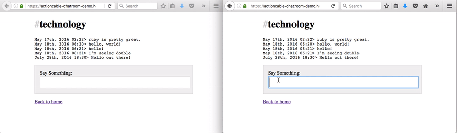

# ActionCable in action

This is a very basic implementation of a chat room using rails 5 and action cable.
It is based on DHH's [screencast][screencast] describing how to use ActionCable
and was extended to include multiple streams to handle different rooms.

[Demo application][demo]

[screencast]: https://www.youtube.com/watch?v=n0WUjGkDFS0
[demo]: https://actioncable-chatroom-demo.herokuapp.com/general
